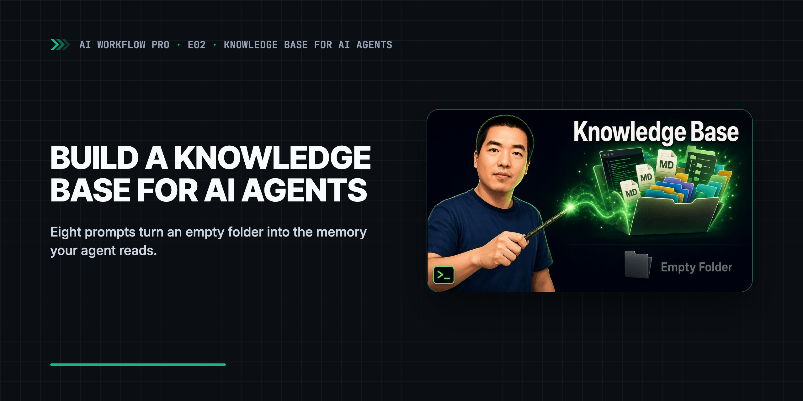

<div align="center">
  <a href="https://www.youtube.com/watch?v=hmdKqGgIHyE">
    <picture>
      <source media="(prefers-color-scheme: dark)" srcset=".github/assets/banner-dark.png">
      <source media="(prefers-color-scheme: light)" srcset=".github/assets/banner-light.png">
      
    </picture>
  </a>
  <p><sub>▶ Watch the video (51 min)</sub></p>
</div>

# Build a Knowledge Base for AI Agents from an Empty Folder

**Knowledge base for AI agents, built from an empty folder in 8 prompts. Plain Markdown your agent reads as memory — Claude Code, Codex, Cursor.**

[](https://aiworkflowpro.com)
[](https://www.youtube.com/watch?v=hmdKqGgIHyE)
[](#tested-with)
[](https://github.com/aiworkflowpro/awp-playbook-knowledgebase-skeleton/releases)
[](#license)

Part 2 of [Build a Knowledge Base for AI Agents](https://www.youtube.com/playlist?list=PLCWXPPyW6CWA) · [← Episode 1](https://www.youtube.com/watch?v=h5BCeUMGuf8) · Episode 3 — coming soon · [Full guide](https://aiworkflowpro.com)

This repo accompanies the video ["I Built a Knowledge Base from an Empty Folder. Here's How."](https://www.youtube.com/watch?v=hmdKqGgIHyE)

---

## Why a knowledge base for AI agents

A knowledge base for AI agents is a folder of plain Markdown files that an agent reads at the
start of every session, so it already knows who you are, what you publish and which rules to
follow. It works with Claude Code, Codex, Cursor, Gemini CLI and any other agent that can read
and write files.

Without one, every session starts from zero and you explain the same background again. This
playbook builds the knowledge base in eight prompts: the agent interviews you, writes the files
from your answers, and indexes each folder so the next session finds everything. My own
knowledge base has close to 800,000 files and still uses the same eight top-level folders.

| | Built-in chat memory | RAG over a vector database | This knowledge base |
|---|---|---|---|
| Where it lives | The vendor's servers | An index you have to host | A folder on your disk |
| What you can read and edit | A short summary | Chunks and embeddings | Every file, in plain Markdown |
| How the agent finds things | Whatever the vendor injects | Similarity search | `CLAUDE.md` indexes in every folder |
| Which agents can use it | That one product | Whatever you wire up | Any agent that reads files |

## Quick Start

Start your agent in the folder where you keep your projects and paste this prompt. The agent
clones the repo, moves into it and runs step 0.

Came here from the Short? The free starter folder it mentions is this repo. Your knowledge
base grows inside `workspace/`, which starts empty.

**Set up the playbook (paste into your agent)**

```text
Working directory: the folder where you keep your projects — the clone lands inside it.

Clone https://github.com/aiworkflowpro/awp-playbook-knowledgebase-skeleton and cd into it.
Run pwd and confirm it ends with awp-playbook-knowledgebase-skeleton.
Read AGENTS.md, then follow steps/00-setup/prompt.md.
Tell me when it is done, and do not start step 1 until I paste it.
```

Or set it up by hand, then start your agent inside the repo:

```bash
git clone https://github.com/aiworkflowpro/awp-playbook-knowledgebase-skeleton
cd awp-playbook-knowledgebase-skeleton
ls steps
```

**Run your agent from this folder.** Every path in the step prompts is relative to the repository
root. Paste the steps in order, answer the agent's questions, and check each result:

| Step | Prompt | What it builds | Sample answer |
|------|--------|----------------|---------------|
| 0 | [Setup](steps/00-setup/prompt.md) | The working directory and an empty `workspace/` | [expected.txt](solutions/00-setup/expected.txt) |
| 1 | [The Skeleton](steps/01-scaffold/prompt.md) | Eight folders, each with a `CLAUDE.md` signpost | [tree.txt](solutions/01-scaffold/tree.txt) |
| 2 | [The Person](steps/02-person/prompt.md) | Who you are and how your brand sounds | [owner-profile.md](solutions/02-person/owner-profile.md) |
| 3 | [The Business](steps/03-business/prompt.md) | Where your work lands: platforms and products | [business-youtube-claude.md](solutions/03-business/business-youtube-claude.md) |
| 4 | [The Rules](steps/04-standards/prompt.md) | Your first rules: naming and quality | [naming-convention.md](solutions/04-standards/naming-convention.md) |
| 5 | [The Workflows](steps/05-workflows/prompt.md) | Your first pipeline, run once for real | [weekly-video-script.md](solutions/05-workflows/weekly-video-script.md) |
| 6 | [The Knowledge](steps/06-research/prompt.md) | Research topics, organized for retrieval | [tree.txt](solutions/06-research/tree.txt) |
| 7 | [The Engine](steps/07-engine/prompt.md) | Dashboard, inbox, four imported files, the standard installed | [tree.txt](solutions/07-engine/tree.txt) |

## What's inside

| Folder | What it is | When you use it |
|--------|------------|-----------------|
| `steps/` | Eight prompts, from [00-setup](steps/00-setup/prompt.md) to [07-engine](steps/07-engine/prompt.md), plus the [import samples](steps/07-engine/import/about-me-draft.md) for step 7 | Paste one per step |
| `reference/` | The Knowledge Base Management Standard, 66 files: [package index](reference/awp-knowledge-management-standard/CLAUDE.md), [naming rules](reference/awp-knowledge-management-standard/naming/kb-naming-segment-convention.md), area skeletons, methodology | Read-only; each step names the files your agent reads |
| `solutions/` | Short sample answers per step, and [the finished knowledge base](solutions/final/CLAUDE.md) from the recorded run (104 Markdown files) | Compare structure and depth after each step |
| `workspace/` | Your knowledge base. Git ignores its contents, so nothing you write is committed back | Your agent writes here and nowhere else |
| [`AGENTS.md`](AGENTS.md) | Instructions for your agent; [`CLAUDE.md`](CLAUDE.md) and [`GEMINI.md`](GEMINI.md) import it | Loaded automatically |

In step 7 your agent copies the standard into `workspace/specs/`, so from then on it reads the
rules from your own knowledge base instead of from this repo.

## Video → repo

The video numbers its chapters from Step 0; the repo numbers steps from 01 and keeps 00 for setup.
Video "Step N" is repo step N+1.

| Time | Video chapter | Repo |
|------|---------------|------|
| [0:00](https://www.youtube.com/watch?v=hmdKqGgIHyE&t=0s) | What does a knowledge base look like? | [solutions/final/CLAUDE.md](solutions/final/CLAUDE.md) |
| [5:12](https://www.youtube.com/watch?v=hmdKqGgIHyE&t=312s) | Step 0 — The Skeleton | [steps/01-scaffold/prompt.md](steps/01-scaffold/prompt.md) |
| [10:33](https://www.youtube.com/watch?v=hmdKqGgIHyE&t=633s) | Step 1 — The Person | [steps/02-person/prompt.md](steps/02-person/prompt.md) |
| [25:17](https://www.youtube.com/watch?v=hmdKqGgIHyE&t=1517s) | Step 2 — The Business | [steps/03-business/prompt.md](steps/03-business/prompt.md) |
| [28:29](https://www.youtube.com/watch?v=hmdKqGgIHyE&t=1709s) | Step 3 — The Rules | [steps/04-standards/prompt.md](steps/04-standards/prompt.md) |
| [36:07](https://www.youtube.com/watch?v=hmdKqGgIHyE&t=2167s) | Step 4 — The Workflows | [steps/05-workflows/prompt.md](steps/05-workflows/prompt.md) |
| [46:14](https://www.youtube.com/watch?v=hmdKqGgIHyE&t=2774s) | Step 5-6 — Knowledge & Engine | [steps/06-research/prompt.md](steps/06-research/prompt.md), [steps/07-engine/prompt.md](steps/07-engine/prompt.md) |

## FAQ

<details>
<summary>CLAUDE.md vs AGENTS.md — which one does this use?</summary>

Both. The repo's own instructions live in [`AGENTS.md`](AGENTS.md), which Codex, Cursor and most
other agents read; `CLAUDE.md` contains the single line `@AGENTS.md`, so Claude Code loads the
same file. Inside your knowledge base, every folder gets a `CLAUDE.md` index, because that is the
file the standard is written around. Any agent can read them as ordinary Markdown.

</details>

<details>
<summary>Does it work without Claude Code, for example with Codex, Cursor or Gemini CLI?</summary>

Yes. The prompts only ask the agent to read files, ask questions and write Markdown. Any agent
with file access can follow them. Start it in the repository root so the relative paths resolve.

</details>

<details>
<summary>How is this different from RAG or an Obsidian vault?</summary>

RAG splits documents into chunks and retrieves them by similarity, so you rarely see what the
agent actually read. Here the agent navigates by folder and by the `CLAUDE.md` index in each one,
and every file is one you can open. The files are plain Markdown, so you can also open
`workspace/` as an Obsidian vault; this playbook adds the structure and indexes an agent needs.

</details>

<details>
<summary>The video shows course/ and knowledge-base/. Where did they go?</summary>

The repo was reorganized after recording. `course/steps/` is now `steps/`,
`course/reference/awp-spec-knowledge-management/` is `reference/awp-knowledge-management-standard/`,
`course/examples/` is split into `solutions/NN-slug/` (the step 7 import samples moved to
`steps/07-engine/import/`), `knowledge-base-complete/` is `solutions/final/`, and
`knowledge-base/` is `workspace/`. The prompts in this repo already use the new paths; see the
[CHANGELOG](CHANGELOG.md).

</details>

<details>
<summary>Why does my knowledge base look different from solutions/final?</summary>

It should. Every file is written from your answers, so names, topics and length will differ.
Compare the structure: eight top-level folders, a `CLAUDE.md` index in each, dated files in
`research/` and `dashboard/`, and the standard under `specs/` after step 7.

</details>

## Tested with

| Agent | Model | Date | Checked |
|-------|-------|------|---------|
| Claude Code 2.1.280 | claude-opus-5-5 | 2026-09-24 | Quick Start prompt and step 0 in a fresh folder |

This video uses `v1.0.0`. The recording shows an earlier folder layout; the FAQ maps old paths to new.

### Troubleshooting

- *The agent cannot find `reference/…`.* It is running in the wrong folder. Have it run `pwd`
  and `cd` into `awp-playbook-knowledgebase-skeleton`.
- *`tree: command not found`.* Install it (`brew install tree` on macOS, `apt install tree` on
  Debian or Ubuntu), or ask the agent to list the folder with `find workspace -maxdepth 2`.

## License

The prose in `steps/`, `reference/` and `solutions/` is licensed under [CC BY 4.0](LICENSE).
The prompts you paste into an agent, `AGENTS.md`, templates and workflow files are licensed under
[MIT](LICENSE-CODE). GitHub's sidebar shows only CC BY 4.0; both licenses apply.

---

<div align="center">
  <a href="https://aiworkflowpro.com">
    <picture>
      <source media="(prefers-color-scheme: dark)" srcset="https://raw.githubusercontent.com/aiworkflowpro/.github/main/assets/wordmark-dark.png">
      
    </picture>
  </a>
  <br>
  <sub>Part of <a href="https://github.com/aiworkflowpro">AI Workflow Pro Playbooks</a> · <a href="https://aiworkflowpro.com">aiworkflowpro.com</a> · <a href="https://x.com/aiworkflowprolk">X</a> · <a href="https://www.youtube.com/channel/UCTVDdiLRI_7TkyFKmZ2-f7Q">YouTube</a></sub>
  <br><br>
  <sub><i>The models get better. Someone still has to use them.</i></sub>
</div>
